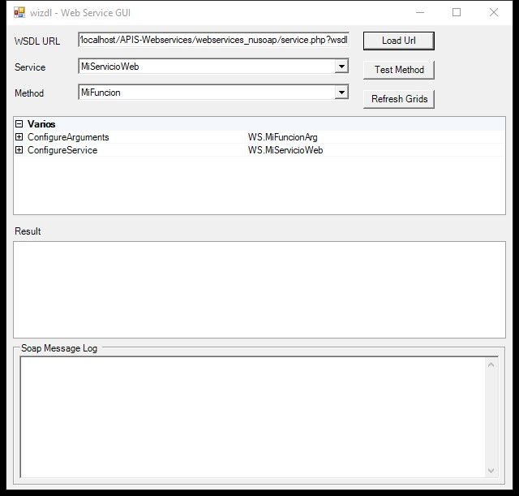
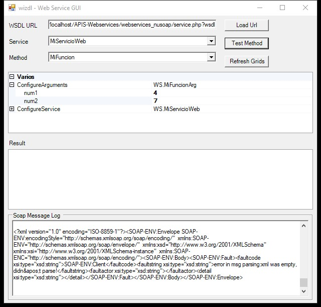
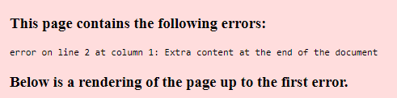

#   WebServices con PHP y NuSoap


##  Servicio
<p aling="center">
    
</p>

##  Consumiendo el servició
Abrimos WIZDL y cargamos la URL de nuestro WSDL y presionamos en el botón de <b>Cargar URL</b>
<p aling="center">
    
</p>

### Resultado
<p aling="center">
    
</p>

####    Presionamos en Método de prueba y obtendremos como mensaje el resultado del servicio:
<p aling="center">
    
</p>

##  Actualización de los parámetros y de la función:
**servicio->register(NombreFuncion, Parametros de Entrada, Parametros de Salida, NameSpace)**
```php
$servicio->register("MiFuncion", array('num1' => 'xsd:integer', 'num2' => 'xsd:integer'), array('return' => 'xsd:string'), $namespace);

//  Funcion
function MiFuncion($num1, $num2){

    $suma = $num1 + $num2;
    $resultado = "El resultado de la suma de " . $num1 . "+" . $num2 . " es: " . $suma;

    return $resultado;  //  Retornando un Entero
}
```

### Resultado
Ingresar los valores en la parte de **WS.MiFunctionArg**
<p aling="center">
    
</p>


#   Librería y Herramienta
##  Librería: NuSoap
[descargar](https://sourceforge.net/projects/nusoap/)

##  Herramienta: WIZDL para ejecutar/consumir servicios
[descargar](https://code.google.com/archive/p/wizdl/downloads)
Descargar la versión <b>wizdl.exe</b>


##  Solución a posibles errores

### Error al ingresar a WSDL
<p aling="center">
    
</p>

### Remplazar el código del archivo `nusoap.php` por el del siguiente repositorio ya que esta versión soporta la versión de PHP 5.6 - 8.2:
[RESPOSITORIO](https://github.com/f00b4r/nusoap/blob/master/src/nusoap.php)