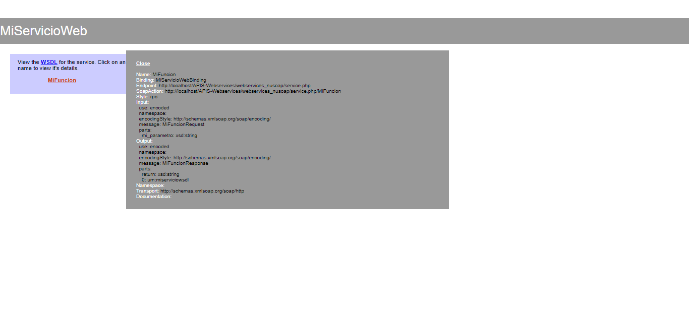
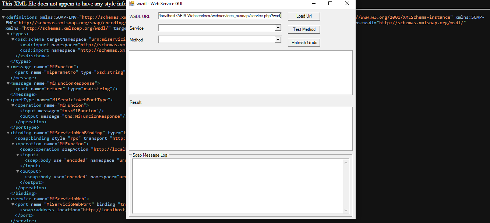

#   WebServices con PHP y NuSoap

##  Servicio

    

##  Consumiendo el servició

    

#   Librería y Herramienta

##  Librería: NuSoap
[descargar](https://sourceforge.net/projects/nusoap/)

##  Herramienta: WIZDL para ejecutar/consumir servicios
[descargar](https://code.google.com/archive/p/wizdl/downloads)

##  Solución a posibles errores

    

### Remplazar el código del archivo `nusoap.php` por el del siguiente repositorio ya que esta versión soporta de la versión de PHP 5.6 - 8.2:
[RESPOSITORIO](https://github.com/f00b4r/nusoap/blob/master/src/nusoap.php)